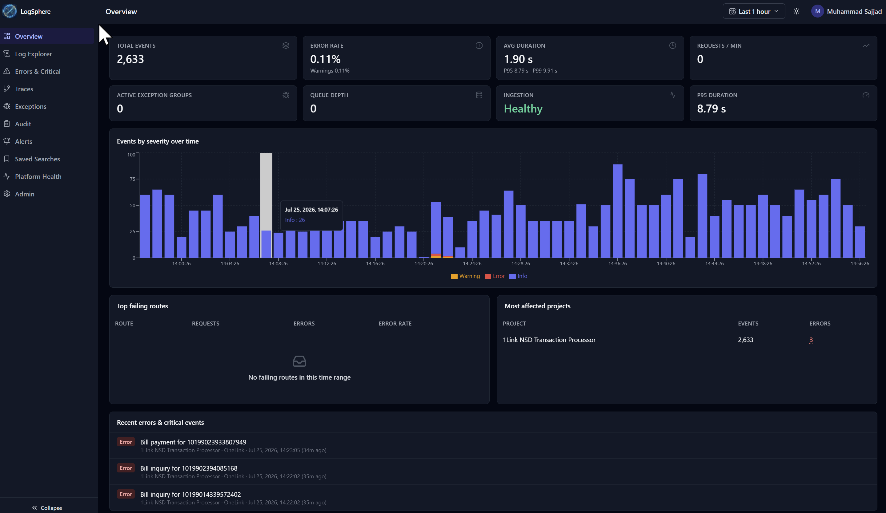
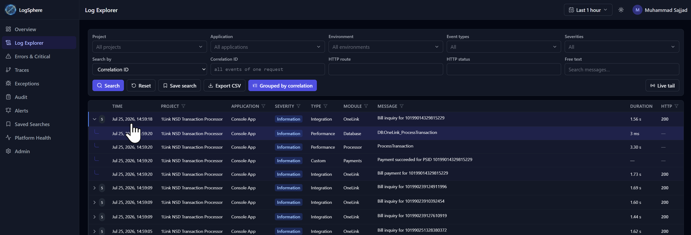
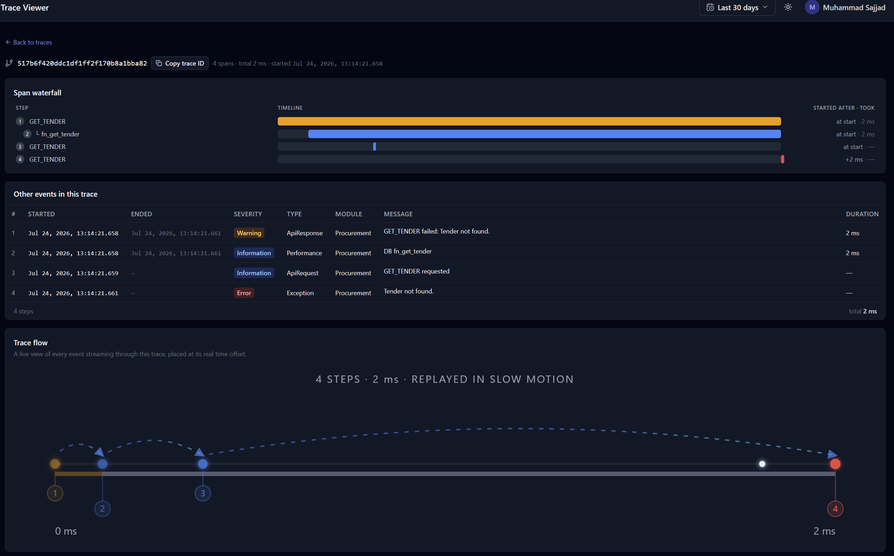
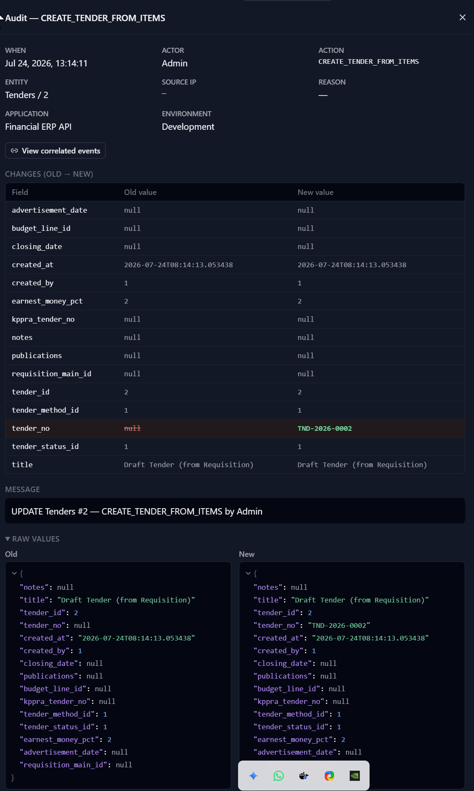
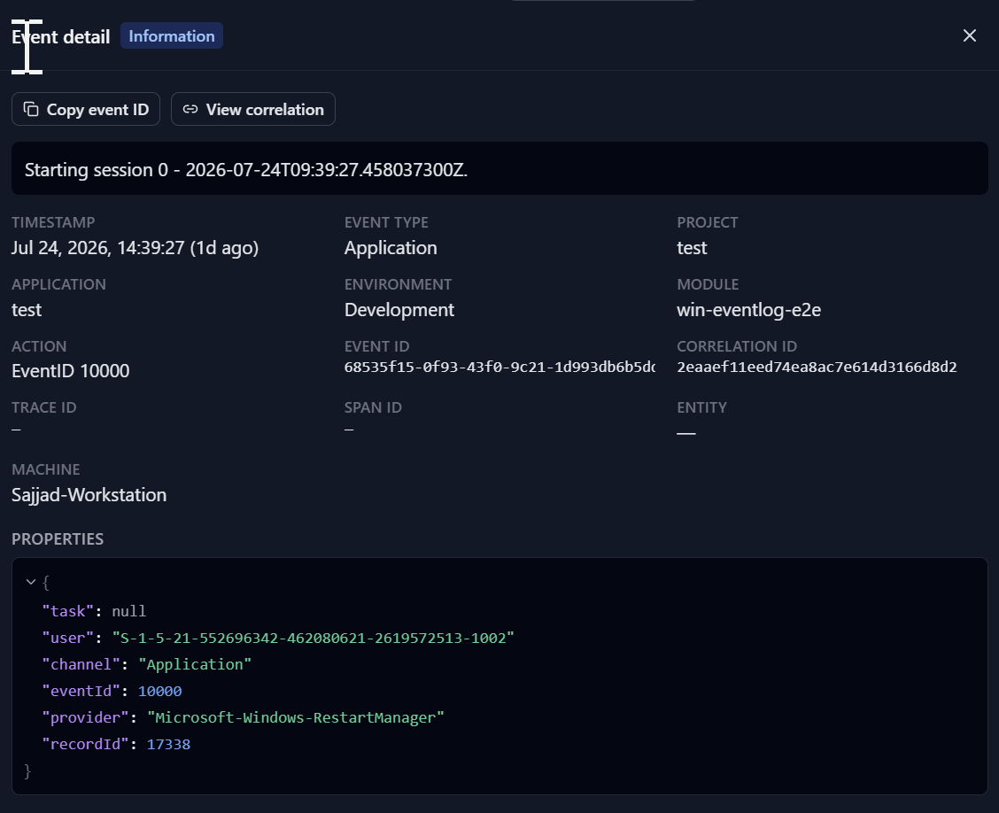

# LogSphere — Centralized Logging, Audit, Monitoring & Exception Management Platform

A reusable, multi-tenant observability platform for all organizational projects: API request/response
logging, audit trails, exception grouping, distributed tracing, performance/integration/background-job
/security/custom events — with dual-layer sensitive-data sanitization, durable asynchronous ingestion,
partitioned PostgreSQL storage, alerting, retention management, RBAC and an enterprise React dashboard.

**Capture from anywhere:**
- **Native SDK** (.NET) — one registration line: auto request/response/exception logging, audit &
  activity loggers, correlation context, caller IP/user-agent stamping, offline buffering
- **OpenTelemetry (OTLP/HTTP)** — `/api/v1/otlp/v1/{logs,traces}`, both `http/protobuf` and
  `http/json`; point any OTel-instrumented app (any language, auto-instrumentation included) at
  LogSphere with two environment variables
- **REST** — one endpoint, one JSON envelope: `POST /api/v1/events/batch`
- **`logsphere-tail`** — single-binary agent that tails log files (regex / JSON-lines / IIS W3C /
  plain) with multiline stack-trace stitching, rotation-safe offsets and at-least-once delivery

**Audit-first by design:** before/after value diffs, actor + source IP on every audit record,
immutable trails, exception fingerprint grouping with triage workflow, dead-man-switch alerts
("the nightly job logged nothing"), and identity that is always resolved server-side from the API
key — a sender cannot lie about which tenant/project/application it is.

## Screenshots

**Overview** — live KPIs, severity timeline, failing routes and most-affected projects at a glance:



**Log Explorer** — Excel-style column filters, free-text search, live tail, and events grouped by
correlation ID so one business request reads as one expandable story:



**Trace Viewer** — span waterfall ("gateway time vs database time"), every event of the trace, and
an animated replay of the request flow:



**Audit Explorer** — immutable who/what/when/from-where with field-level old → new diffs:



**Event detail** — full envelope of any event, including enriched properties (here: a Windows
Event Log record captured by the `logsphere-tail` agent):



## Why LogSphere instead of ELK / Grafana / Datadog?

Those are excellent general-purpose observability stacks. LogSphere is built for a different
center of gravity: **business applications where the audit trail is a first-class requirement**
— ERPs, financial systems, government/back-office software.

| | LogSphere | General log stacks |
|---|---|---|
| **Audit semantics** | Native: before/after value diffs, changed-field highlighting, actor + source IP + reason on every record, immutable trail | A document store — you build audit UX yourself |
| **Sender identity** | Resolved **server-side from the API key**; a sender cannot lie about its tenant/project/application | Whatever the shipper claims |
| **Sensitive data** | Sanitized server-side before storage (passwords, tokens, cards, configurable rules) — a platform guarantee | Per-pipeline DIY that someone eventually forgets |
| **Exception handling** | Fingerprint grouping + triage workflow (status, assignee, notes) built in | Needs Sentry or custom work |
| **Silence detection** | Dead-man-switch alerts with schedules ("the nightly job logged nothing on a workday") | Rarely first-class |
| **Operational weight** | Two containers + PostgreSQL | Cluster with heap tuning, shards, ILM |
| **Ingestion** | Native SDK, OTLP (protobuf + JSON), plain REST, file/Event-Log tailing agent | Rich ecosystem (Beats, agents, …) |

**When NOT to choose LogSphere (honest edition):** if your dominant need is relevance-ranked
full-text search over terabytes, per-port bandwidth dashboards, ML anomaly detection, or a
metrics/APM suite — use Elastic or Grafana; they are the right tool there. LogSphere's sweet spot
is tens-to-hundreds of GB of *structured* application, audit and exception events where
"who did what, from where, and what broke" is the question that matters — answered out of the box
on one PostgreSQL instance.

## Repository layout

| Path | Contents |
|---|---|
| [docs/DESIGN.md](docs/DESIGN.md) | Full architecture design package (26 sections, Mermaid diagrams, queue comparison, threat model, roadmap) |
| [docs/API.md](docs/API.md) | REST API contract (event envelope, all endpoints) |
| [docs/DATABASE.md](docs/DATABASE.md) | Database design notes (partitioning, indexing, retention) |
| [db/migrations](db/migrations) | PostgreSQL schema + reference seed (applied automatically at API startup) |
| [backend](backend) | .NET 10 solution: `LogSphere.Core` (domain/sanitization/repositories/workers), `LogSphere.Api` (ingestion + dashboard API + hosted workers), `LogSphere.Sdk` (client SDK), `LogSphere.Tests` |
| [frontend](frontend) | React + TypeScript + Tailwind dashboard (Vite) |
| [deploy](deploy) | Docker Compose, Dockerfiles, Nginx config, `.env.example` |

## Quick start (Docker)

```bash
cd deploy
cp .env.example .env       # change every secret
docker compose -f docker-compose.bundled-db.yml up -d --build
# Dashboard: http://localhost:8080  (login: admin / value of ADMIN_PASSWORD)
```

The bundled-db stack brings its own PostgreSQL container. To use an existing PostgreSQL/PgBouncer
instead, set `DB_HOST`/`DB_PORT` in `.env` and use `docker-compose.yml`.

## Quick start (local development)

Prereqs: .NET 10 SDK, Node 20+, PostgreSQL 15+ with a `logsphere` database.

```powershell
# API (port 5090) — applies migrations, seeds admin (+ demo data in Development)
cd backend/src/LogSphere.Api
$env:ASPNETCORE_ENVIRONMENT='Development'
$env:ConnectionStrings__LogSphere='Host=localhost;Port=5432;Database=logsphere;Username=postgres;Password=...'
dotnet run

# Dashboard (Vite dev server, proxies /api -> localhost:5090)
cd frontend
npm install
npm run dev
```

Default dev login: `admin / Admin#12345` (change immediately; configurable via `Seed:AdminPassword`).
In Development with `Seed:DemoData=true`, two demo projects are created and their **ingestion API keys
are printed once in the API console log**.

## Integrating an application (.NET SDK)

```csharp
builder.Services.AddCentralLogging(options =>
{
    options.Endpoint = "https://logs.example.com";
    options.ProjectKey = builder.Configuration["LogSphere:Key"]; // ls_<keyId>.<secret>
    options.ApplicationName = "Billing API";
    options.Environment = "Production";
    options.OfflineBufferDirectory = "C:/logs/logsphere-buffer";  // optional disk fallback
});
...
app.UseLogSphere(); // correlation + exception capture + request/response logging
```

```csharp
// audit trail
await auditLogger.LogAsync("CandidateApproved", "CandidateApplication", candidateId,
    oldValues: oldData, newValues: newData, reason: "Documents verified");

// business-entity scope — all logs inside carry the entity reference
using var scope = CorrelationContext.BeginBusinessScope("Payment", paymentId);

// custom domain event
activityLogger.LogEvent("PaymentReconciled", new { gateway = "XYZ", amount },
    entityType: "Payment", entityId: paymentId);
```

Non-.NET applications integrate via the REST contract in [docs/API.md](docs/API.md):
`POST /api/v1/events/batch` with header `X-LogSphere-Key`.

## Operations

* **Credentials**: created per application/environment in Admin → Applications; the plaintext key is
  shown once. Rotation = create new + revoke old. Hashed with HMAC-SHA256 + server pepper
  (`LOGSPHERE_KEY_PEPPER`).
* **Sanitization**: global default redaction rules are seeded (passwords, tokens, cards, CNIC, biometrics…)
  and always enforced server-side; add tenant/project rules in Admin → Redaction Rules. Strategies:
  Remove, Redact, MaskLast4, Hash.
* **Retention**: policies in Admin → Retention; the retention worker deletes expired rows hourly and
  drops whole monthly partitions past the longest window. `legal_hold` suppresses destructive actions.
* **Alerts**: rules (8 condition types incl. ingest-silence and queue depth) with dedup + cooldown;
  channels: Email (SMTP config) and Webhook (Slack/Teams-compatible).
* **Health**: `/health`, `/health/ready`, dashboard → Platform Health (queue depth, DLQ, workers,
  partition sizes, events/sec, auth/sanitization failures).

## Production checklist

1. Set strong `JWT_SECRET`, `KEY_PEPPER`, `SANITIZATION_HASH_KEY`, DB password (never commit them).
2. Change the admin password; create scoped users (grants per tenant/project/environment/category).
3. Put TLS in front of Nginx (or terminate at your load balancer).
4. Configure SMTP for email alerts; add webhook channels.
5. Set `Seed:DemoData=false` (default outside Development).
6. Schedule PostgreSQL base backups + WAL archiving; consider a streaming replica for dashboard reads.
7. Review retention policies against your compliance requirements.

## Tests

```bash
cd backend && dotnet test     # 98 tests: sanitization/secret-leakage, fingerprinting, authz, OTLP translation & protobuf decoding, tail parsers, enrichment, envelope validation
cd frontend && npm run build  # type-checks and builds the dashboard
```

## License

Apache License 2.0 — see [LICENSE](LICENSE). Contributions are welcome, see
[CONTRIBUTING.md](CONTRIBUTING.md); please report vulnerabilities per [SECURITY.md](SECURITY.md).
