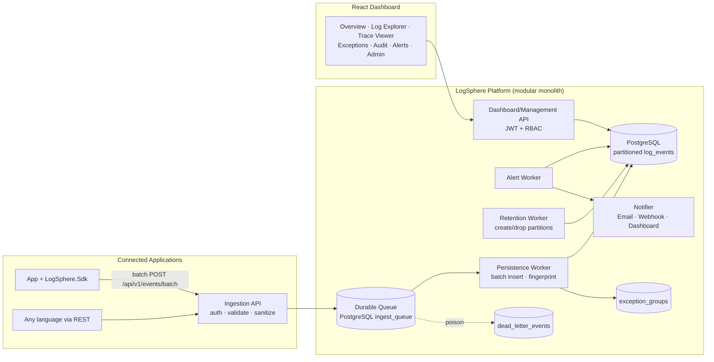

# LogSphere — Centralized Logging, Audit, Monitoring & Exception Management Platform

**Design Package v1.0** — Principal architecture document.

---

## 1. Executive Summary

LogSphere is a reusable, multi-tenant, multi-project observability platform. Any application in the
organization (API, worker, desktop, mobile backend) sends structured events — API request/response
logs, audit trails, exceptions, performance measurements, integration calls, background-job runs,
security events, and custom domain events — to a single secure ingestion API. Events are sanitized
twice (SDK-side and server-side), placed on a durable queue, persisted into partitioned PostgreSQL
storage by background workers, grouped (exceptions) and evaluated against alert rules, and explored
through a role-based React dashboard.

**Key decisions (summary):**

| Decision | Choice | Rationale |
|---|---|---|
| Deployment shape | Modular monolith (one API host + in-process hosted workers, separable later) | Spec §30; lowest operational complexity |
| Queue | **PostgreSQL-backed durable queue** (`FOR UPDATE SKIP LOCKED`), behind an `IEventQueue` abstraction | See §13; zero extra infrastructure, transactional durability, ample for initial volume; swap to RabbitMQ when >2–3k events/sec sustained |
| Ingestion API | **One unified event endpoint** with typed envelope + batch endpoint | One schema/validation/auth path; category carried in envelope (§14) |
| Event storage | **Hybrid**: one partitioned `log_events` envelope table with JSONB payload columns + specialized aggregate tables (`exception_groups`) and config tables | Spec §14 preference; single write path, no fan-out joins |
| Partitioning | Monthly RANGE partitions on `event_timestamp` (worker auto-creates/drops; switchable to daily) | Retention = partition drop |
| Ingestion auth | Per-application API keys (`ls_<keyId>.<secret>`), stored as HMAC-SHA256 hashes, env-scoped, revocable, rotatable | §12 |
| Dashboard auth | Username/password (PBKDF2) → JWT with role + resource scopes; server-side authorization on every query | §13 |
| Search | Indexed relational columns + JSONB GIN + trigram on `message`; `ISearchProvider` abstraction so OpenSearch can be added later | §17 |
| Correlation | `X-Correlation-ID` + W3C `traceparent` accepted; trace/span/parent-span columns first-class | §5 |

---

## 2. Product Understanding

The platform answers, across unrelated projects with strict logical isolation:
*what happened during request X, who did it, what failed, how long it took, which downstream calls
occurred, is this exception recurring, and what happened to business entity Y over time.*
It is a product, not a feature: standard integration via SDK + REST ingestion API, project
registration, credentials, RBAC, redaction rules, retention policies, alerting and dashboards are
all first-class, project-agnostic capabilities.

## 3. Assumptions

1. Initial volume: ≤ ~500 events/sec sustained across all projects (capacity questions in §29 refine this).
2. Single-region, single PostgreSQL instance initially (streaming replica recommended for production).
3. Tenants are internal organizations/customers of one company; hard multi-tenancy (separate DBs) not required initially — row-level isolation with mandatory tenant/project predicates enforced in the data layer.
4. Average event size ≈ 2–8 KB after sanitization; max accepted event 256 KB, max batch 500 events / 5 MB.
5. Clock skew exists between sources; `event_timestamp` (source) and `received_timestamp` (server) are both stored; ordering uses trace/span relationships (§15 of spec).
6. Email + webhook (Slack/Teams-compatible) are sufficient notification channels for MVP.
7. .NET SDK first; other SDKs integrate via the documented REST contract.
8. Dashboard concurrency ≤ 50 users initially.

## 4. Important Architecture Questions (answered with defaults; revisit at capacity review)

| Question | Default assumed |
|---|---|
| Peak and sustained events/sec per project? | 500/s sustained platform-wide, 2k/s burst |
| Retention per category? | Defaults in §18; configurable per tenant/project/category |
| Compliance regime (GDPR-like, local)? | Masking + retention + export audit assumed sufficient; legal-hold flag provided |
| Cross-DC/DR requirements? | Nightly base backup + WAL archiving; RPO 15 min, RTO 4 h |
| SSO (AD/OIDC) for dashboard? | Local accounts MVP; OIDC hook-point documented |

---

## 5. Recommended Architecture

### Component Responsibilities

| Component | Responsibilities |
|---|---|
| **Ingestion API** (`/api/v1/events*`) | API-key auth, rate limiting, envelope validation, size limits, **server-side sanitization**, enqueue, fast 202 ack |
| **Persistence Worker** | Dequeue batches (`FOR UPDATE SKIP LOCKED`), idempotent insert (unique `event_id`), exception fingerprinting + group upsert, poison → dead letter |
| **Alert Worker** | Evaluate enabled rules on interval windows, dedup/cooldown, write `alert_occurrences`, dispatch notifications |
| **Retention Worker** | Pre-create future partitions, drop expired partitions per policy, legal-hold guard, storage stats |
| **Dashboard API** | JWT auth, RBAC-filtered queries, stats, traces, exception workflow, audit explorer, saved searches, exports (audited), admin CRUD |
| **.NET SDK** | Correlation middleware, request/response + exception capture, audit/custom events, client-side sanitization, batching, retry + circuit breaker, bounded buffer with optional disk fallback |
| **Health subsystem** | `/health` (liveness/readiness), `/api/v1/system/metrics`: queue depth, DLQ size, processed/sec, failed writes, ingest latency, sanitization failures, auth failures |

All workers are hosted services in the same process, individually toggleable via configuration
(`Workers:Persistence:Enabled` …) so any of them can be split into its own deployment unit without
code changes.

---

## 6. End-to-End Data Flow

1. Source app produces a structured event; SDK attaches tenant/project/app/env context, correlation + trace IDs, business-entity scope.
2. **SDK sanitizes** (blocklist/allowlist rules, size truncation) and appends to an in-memory bounded channel.
3. Background sender batches (≤200 events / 2 s), POSTs with API key; retry with exponential backoff + jitter; circuit breaker; optional disk fallback; drops oldest on overflow (never blocks the app).
4. Ingestion API authenticates key → resolves tenant/project/application/environment; validates envelope + limits.
5. **Server re-sanitizes** every payload (never trusts the client); records `sanitization_applied`, `fields_sanitized`, `truncated`.
6. Event inserted into `ingest_queue` (durable, transactional). API returns `202` with accepted/rejected counts.
7. Persistence Worker claims batches, inserts into `log_events` (`ON CONFLICT (event_id) DO NOTHING` → idempotent), maintains `exception_groups`.
8. Alert Worker evaluates rules over the fresh data; notifications dispatched with dedup + cooldown.
9. Dashboard queries the data with mandatory tenant/project scoping.

**Failure behavior:** LogSphere down → SDK buffers/drops locally, app unaffected. DB down → ingestion API returns 503, SDK retries/buffers. Worker crash → queue rows remain claimed-but-unprocessed and are re-claimed after visibility timeout. Poison events → `dead_letter_events` with safe diagnostics.

---

## 7. Correlation and Trace Design

* Middleware order: correlation first. Accept `X-Correlation-ID` (validated: ≤ 64 chars, safe charset) else generate GUID; always echoed in response header and response envelope.
* W3C `traceparent` parsed when present → `trace_id`, `span_id`, `parent_span_id` columns; SDK propagates both headers downstream and into queue messages / background jobs.
* Identifier model: **event_id** (one record, GUIDv7) · **correlation_id/trace_id** (one flow) · **span_id** (one operation) · **business_entity_type/id** (one business record across many flows). All are first-class indexed columns.
* Ordering: reconstructed from span parent/child + timestamps (+ optional `sequence` inside one process); global insert order is explicitly *not* trusted (documented limitation for distributed clocks).

## 8. Security & Sanitization Design

Two mandatory layers (SDK + server) with identical engine semantics:

* **Rules**: global defaults (password, secret, token, authorization, cookie, api_key, cvv, card/account number, iban, cnic, biometric/face/fingerprint template, private key, connection string, jwt, session, pin, dob, phone, email …) + tenant/project-specific rules; case-insensitive substring/regex key matching; recursive over JSON objects/arrays, query strings, headers, form data, exception data.
* **Strategies**: `Remove`, `Redact` (`[REDACTED]`), `MaskLast4`, `Hash` (HMAC-SHA256 with server key), `Truncate`; per-route `DoNotLogBody`; **allowlist mode** per module/route where only approved fields survive.
* **Limits**: request/response body 64 KB each, stack trace 32 KB, properties 32 KB, total event 256 KB — safe truncation with `truncated=true` metadata.
* **Binary**: multipart/binary content never stored; metadata only (name, MIME, size, hash).
* **Audit of sanitization**: `sanitization_applied`, `sanitized_field_count`, `rule_version` — never the removed value.
* Dashboard renders all values as text (no HTML interpretation) — stored XSS neutralized at render; API also strips control characters to prevent log forging.

## 9. Multi-Tenant Authorization

Hierarchy: Tenant → Project → Application → Environment → Module/Component.
Roles: SuperAdmin, TenantAdmin, ProjectAdmin, Developer, Support, SecurityAuditor, ComplianceAuditor, ReadOnly.
`user_access_grants` bind user → role → scope (tenant / project / environment / category / severity floor, plus flags `can_view_bodies`, `can_export`, `can_view_security_logs`).
**Every** dashboard query passes through an access-filter builder that injects allowed tenant/project/environment/category predicates into SQL — authorization is enforced in the data layer, never only in the UI. Field-level security: request/response bodies withheld unless `can_view_bodies`.

## 10–12. Database Design, Partitioning, Indexing

See [DATABASE.md](DATABASE.md) and `db/migrations/001_schema.sql` (authoritative DDL). Highlights:

* `log_events` — monthly RANGE partitions on `event_timestamp`; common envelope columns + `properties/request_data/response_data/exception_data` JSONB; append-only.
* Indexes (per partition): `(project_id, event_timestamp DESC)` core browse; `(correlation_id)`; `(trace_id)`; `(business_entity_type, business_entity_id)` partial; `(exception_fingerprint)` partial WHERE event_type='Exception'; `(severity, event_timestamp)` partial WHERE severity>=Error; GIN on `properties jsonb_path_ops`; GIN trigram on `message`. No blanket indexing.
* `exception_groups` — fingerprint aggregate (first/last seen, counters, status workflow, assignment).
* Audit immutability: DB trigger rejects UPDATE/DELETE on audit-category rows + app user lacks those privileges on event partitions.
* Retention: per-scope policies; worker drops whole partitions (plus category-level deletes only where a partition mixes categories with different windows — mitigated by partition-per-month granularity and category retention normalization to month boundaries).

## 13. Queue Recommendation

| Option | Throughput | Durability | Ops complexity | Verdict |
|---|---|---|---|---|
| Kafka | Very high | Excellent | High (brokers, ZK/KRaft, tuning) | Overkill now; revisit at >10k ev/s or multi-consumer streaming |
| RabbitMQ | High | Good (quorum queues) | Moderate (extra service, HA config) | Best *second* step; `IEventQueue` swap target |
| Redis Streams | High | Moderate (AOF caveats) | Moderate; Redis not otherwise required | Weaker durability story for a system of record |
| **PostgreSQL queue** | ~2–5k ev/s | Excellent (same WAL/backup as data) | **None extra** | ✅ **Chosen for v1** — transactional, durable, zero new infrastructure; spec's lightweight option |

Trigger to migrate: sustained queue depth growth at >2–3k events/sec, or need for independent scaling of ingestion vs. persistence beyond what worker concurrency provides.

## 14. API Design & 15. Event Schema

Full contract in [API.md](API.md). Unified envelope endpoint chosen (single auth/validation/sanitization path; category-specific sub-payloads keep typing); response envelope `{success, statusCode, statusDetails, data, correlationId}` platform-wide; correct HTTP codes; no stack traces to clients; `schemaVersion` mandatory; invalid events → dead letter with safe diagnostics.

## 16. Dashboard Design

Modules: **Overview** (KPIs, error rate, ingestion health, queue depth, top failing projects/routes, recent criticals) · **Project dashboard** (trends, P95/P99, environment comparison) · **Log Explorer** (fast filters incl. correlation/entity/severity/category/route/status/fingerprint/free text; live tail w/ pause; expandable detail; correlation & trace pivots) · **Trace Viewer** (span waterfall) · **Exceptions** (groups, trends, status workflow, assignment, sample stack) · **Audit Explorer** (who/what/when/old→new diff) · **Alerts** (rules, occurrences, ack/resolve) · **Saved Searches** (share, pin) · **Admin** (tenants, projects, apps, credentials, users/grants, redaction rules, retention, notification channels) · **Platform Health**. Dark/light themes; unauthorized fields never delivered by the API.

## 17. Alerting Design

Rules: scope (tenant/project/env) + condition type (`ErrorCountThreshold`, `ErrorRatePercent`, `SameFingerprintCount`, `DurationP95Threshold`, `SeverityDetected`, `AuthFailureCount`, `IngestSilence` i.e. app stopped logging, `QueueDepth`) + window + threshold + cooldown + channels. Worker evaluates windows each 30 s; dedup key = (rule, scope, fingerprint bucket); cooldown suppresses storms; occurrences carry ack/resolve workflow; channels: Email (SMTP), generic Webhook (Slack/Teams compatible), dashboard notification. Maintenance windows suppress per scope.

## 18. Retention Strategy

Defaults: Trace/Debug 7 d · Info 30 d · API req/resp 90 d · Performance 90 d · Exceptions 180 d · Audit 7 y · Security ≥ 1 y. Policies per tenant/project/env/category with month-granularity enforcement via partition drop; optional archive-before-drop (`COPY` to compressed file storage); legal-hold flag blocks drops covering held scopes; retention-preview report endpoint.

## 19. Deployment Model

Docker Compose: `postgres` (v18) · `logsphere-api` (API + workers) · `logsphere-web` (Nginx serving React build, proxying `/api`) . TLS terminated at Nginx; secrets via environment/.env (never in source); healthchecks wired; Kubernetes-ready (stateless API, config via env). Scale-out path: N API replicas + dedicated worker replicas (config toggles), PG replica for dashboard reads.

## 20. Failure Scenarios (design responses)

Log server down → SDK buffer/backoff/drop-oldest, app unaffected · DB down → 503 + SDK retry; workers pause · Poison event → DLQ after N attempts · Duplicate delivery → `event_id` idempotency · Queue flooding → per-key rate limits + 429 + backpressure · Worker crash → visibility-timeout reclaim · Alert storm → dedup + cooldown · Partition missing → default partition + auto-create + health alarm.

## 21. Testing Strategy

Unit (sanitizer incl. **fake-secret leak tests**, fingerprinting, envelope validation, access-filter builder) · Integration (Postgres: enqueue→persist→query, idempotency, partition mgmt, retention) · AuthZ tests (cross-tenant isolation, category/severity scoping, body visibility) · Contract tests on ingestion API · Load (batch ingest throughput) · Failure injection (DB down, queue full, duplicate, oversized) · Alert dedup tests · Export redaction tests. Implemented suite: `backend/tests/LogSphere.Tests`.

## 22. Threat Model (summary — mitigations implemented)

| Threat | Mitigation |
|---|---|
| Forged project IDs | Context derived from the API key server-side; client-supplied tenant/project ignored for auth |
| Stolen API key | Hashed storage, env-scoping, expiry, revocation, rotation, optional IP allowlist, rate limiting |
| Replay | HTTPS + short timestamp tolerance on signed mode; idempotent `event_id` makes replays inert |
| Log/JSON/HTML injection | Strict JSON parsing, control-char stripping, text-only rendering, parameterized SQL only |
| Oversized payload DoS | Request/body/batch caps enforced before parse; 413 |
| Queue flooding | Per-key rate limits, 429, queue-depth alerting |
| Cross-tenant access | Data-layer access filters on every query + isolation tests |
| Sensitive-data leakage | Dual sanitization, allowlist mode, no-body routes, field-level RBAC, export redaction |
| Log tampering / audit deletion | Append-only events, audit immutability trigger, restricted DB role |
| Unauthorized export | Export permission + limits + audit trail of every export |
| Credential exposure in config | Secrets via env vars; keys shown once at creation |
| Insider misuse | Dashboard access audit, least-privilege grants, security-log restricted role |

## 23. MVP Definition

**In:** tenant/project/app/env management, credentials, unified ingestion + batch, dual sanitization, PG queue + persistence worker, partitioned storage + auto partition mgmt, correlation/trace capture, exception fingerprint + groups + workflow, alert rules (core condition types) + email/webhook, retention worker, JWT/RBAC dashboard API, React dashboard (overview, explorer w/ live tail, trace viewer, exceptions, audit, alerts, saved searches, admin, health), CSV/JSON export with audit, .NET SDK, Docker Compose.
**Deferred:** OpenSearch, SMS/WhatsApp, PDF export, signed-request/cert credentials (schema ready), OIDC SSO, AI analysis (Phase 5 — design keeps redacted data + correlation references AI-ready), Kafka/RabbitMQ swap, cold-storage automation, multi-region.

## 24. Implementation Roadmap

Phase 1 design (this package) → Phase 2 core platform → Phase 3 operational features → Phase 4 scale/search → Phase 5 AI. Phases 2–3 are delivered in this repository; 4–5 have explicit extension seams (`IEventQueue`, `ISearchProvider`, notification channel registry, envelope `schemaVersion`).

## 25. Risks & Tradeoffs

* PG-as-queue couples ingestion durability to the primary DB — acceptable at target volume; abstraction + migration trigger defined.
* Trigram/GIN indexes cost write amplification — applied only to `message` and `properties`; monitored via storage stats.
* Month-granularity retention is coarser than per-day policies — simplest safe partition-drop model; daily partitioning is a config change.
* Single-node PG is the availability bottleneck — replica + WAL archiving recommended before broad production rollout.
* JWT local accounts lack org SSO — OIDC integration point documented for Phase 4.

## 26. Approval Checklist

☑ Architecture & components ☑ Queue choice ☑ Unified envelope API ☑ Hybrid DB + partitioning + indexes ☑ Sanitization layers ☑ AuthN/AuthZ model ☑ Alerting ☑ Retention ☑ Deployment ☑ Testing ☑ Threat model ☑ MVP scope — *approved for implementation per product owner instruction to develop the full system.*
